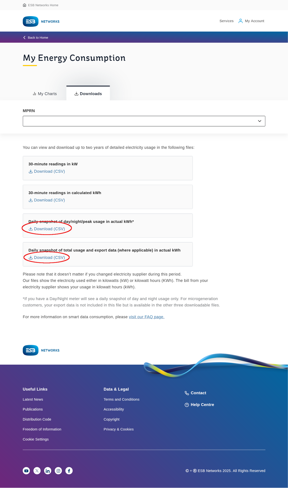

This is a Python tool designed to be used with the daily
Hierarchical Data Format (HDF) Comma Separated Variable (CSV)
files generated by a Smart meter.

## Accessing files

If you live in Ireland and are on a Smart Meter tariff (with any electricity supplier)
you can download the 30 minute and **daily** CSV files from the
[ESB Networks website](https://www.esbnetworks.ie/existing-connections/meters-and-readings/my-smart-datadata).

This tool is for handling Daily data (only) downloaded from the site and
can handle both the Day/Night/Peak file and the Import/Export file together.

See screenshot for where to download these files.



## Handling multiple files

Because these file will only contain the last 2 years of data, this tool
can combine equivalent older files with newer files to create a complete dataset.

Because there can sometimes be gaps in the data that are filled in at a later date
the tool will take the maximum value for each day.

## Conversion to spreadsheet

The tool converts the data to a spreadsheet format that is a pivot table of the data
with columns by data type and by year.

It contains 2 sheets:

* Daily - a row per day of the year
* Monthly - a row per month of the year

each of which facilitates comparison of energy usage year-on-year.

The columns produced (depending on your source data) are:

* 24 Hr Active Export Register (kWh)
  * This is the meter reading in KWh at the start of the day.
  * This is in absolute units since the meter was installed.
  * It should be the sum of the Day/Night/Peak columns.
  * If a value is missing it will be forward filled from the previous day.
  * There will be a year sub column for each year in the dataset. e.g.
    2023, 2024 and 2025 if you have 2 or 3 years of data.
* 24 Hr Active Import Register (kWh)
  * This is the cumulative count of kWh exported to the grid if you are part of
    the Micro-generation Support Scheme (MSS).
* Day Off-Peak Import Register (kWh)
  * This is the cumulative count of kWh imported from the grid during the off-peak
    period - 8am to 5pm (08:00 - 17:00) and 7pm to 11pm (19:00 - 23:00).
* Day Peak Import Register (kWh)
  * This is the cumulative count of kWh imported from the grid during the peak
    period - 5pm to 7pm (17:00 - 19:00).
  * Depending on your tariff this will be the most expensive time to use electricity.
  * This may not be present in your data if you are not on a time of use tariff.
* Night Import Register (kWh)
  * This is the cumulative count of kWh imported from the grid during the night
    period - 12am to 7am (00:00 - 07:00) and 11pm to 12am (23:00 - 00:00).
  * Depending on your tariff this will be the least expensive time to use electricity.
  * This may not be present in your data if you are not on a time of use tariff.

As these cumulative values make it hard to compare usage between days/months
and across years, there will be an additional column for each of the above
columns that is the difference between the current day and the previous day.
This will allow you to see the daily usage.

The tool will work with only one MPRN and one Meter Serial number at a time.
Support for more than this may come in the future.

The spreadsheet created will be saved in the same directory as the input files
with the name `<MPRN>-<Meter Serial Number>-<ndays>_data.xlsx`.

When opened in a tool like Excel or LibreOffice, the spreadsheet will be formatted
as a pivot table, and graphs can easily be created to show usage over time.

## Installation

Currently this tool is not available on PyPi so you will need to clone the repository
and install the dependencies using Poetry.

1. Clone the repository:

    ```sh
    git clone https://github.com/SeanCondon/meter-daily-csv-to-google-form.git
    cd meter-daily-csv-to-google-form
    ```

2. Install Poetry:

    ```sh
    curl -sSL https://install.python-poetry.org | python3 -
    ```

3. Install dependencies:

    ```sh
    poetry install
    ```

## Usage

1. Run the script:

    ```sh
    poetry run python main.py <days> <input_file(s)>
    ```

    Where `<days>` is the number of days of data to extract and
    `<input_file(s)>` is the set of files to process. You can pass in multiple
    files at once.

## Example

There are example files in the `../test` directory that you can use to test the tool.

```sh
poetry run python main.py 1000 \
../test/HDF_Daily_kWh_01234567890_20-12-2024.csv \
../test/HDF_Daily_kWh_01234567890_26-12-2024.csv \
../test/HDF_DailyDNP_kWh_01234567890_20-12-2024.csv
```

This will create a spreadsheet with 1000 days of data from the 3 files.
